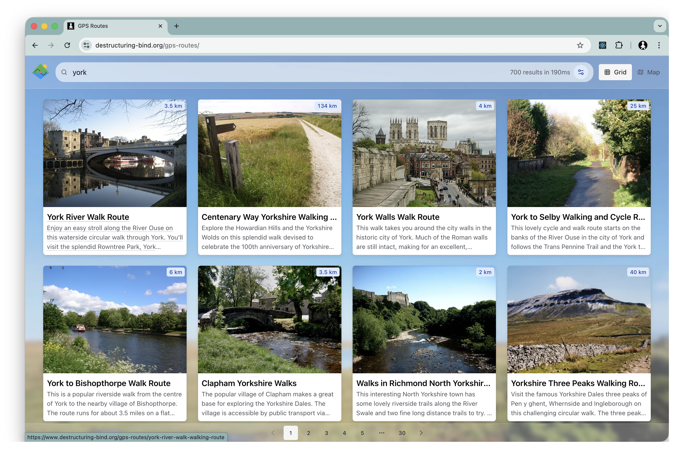

# GPS Routes

**GPS Routes** is a modern, interactive web application designed for outdoor enthusiasts to search, view, and explore GPS tracks. Whether you are planning a hike, a cycling trip, or a scenic drive, GPS Routes provides a rich interface to visualize routes and their details.



## Key Features

### Interactive Mapping

- **Rich Map Interface:** Powered by Leaflet, offering a smooth and responsive map experience.
- **Route Visualization:** Native support for rendering **GPX** and **KML** files directly on the map.
- **Points of Interest:** Explore landmarks and key locations along your route.
- **User Location:** Quickly find routes near your current location with one-click geolocation.
- **Fullscreen Mode:** Immerse yourself in the map with a dedicated fullscreen view.

### Powerful Search & Discovery

- **Smart Search:** Instantly find routes by name, location, or keyword.
- **Advanced Filtering:** Narrow down results using dynamic facets (e.g., difficulty, distance, region).
- **Instant Feedback:** See search stats and pagination controls updated in real-time.
- **Detailed Results:** Browse route cards with key metrics, descriptions, and quick actions.

### Modern User Experience

- **Responsive Design:** Fully optimized for desktop, tablet, and mobile devices.
- **Modern Aesthetics:** Built with Chakra UI and a glassmorphism-inspired design language.
- **Fast Navigation:** Instant page transitions powered by TanStack Router.

## For Contributors

We welcome contributions! This project is built with a modern React stack and emphasizes type safety and performance.

### Tech Stack

- **Core:** [React 19](https://react.dev/) & [TypeScript](https://www.typescriptlang.org/)
- **Build Tool:** [Vite 7](https://vitejs.dev/)
- **Routing:** [TanStack Router](https://tanstack.com/router) (File-based routing)
- **State Management:** [Jotai](https://jotai.org/)
- **UI Components:** [Chakra UI v3](https://chakra-ui.com/) & [Emotion](https://emotion.sh/)
- **Maps:** [Leaflet](https://leafletjs.com/) & [React Leaflet](https://react-leaflet.js.org/)
- **Data Parsing:** [@tmcw/togeojson](https://github.com/tmcw/togeojson) (GPX/KML to GeoJSON)
- **Testing:** [Vitest](https://vitest.dev/)

### Getting Started

1.  **Clone the repository:**

    ```bash
    git clone <repository-url>
    cd gps-routes
    ```

2.  **Install dependencies:**
    This project uses Yarn 4.

    ```bash
    yarn install
    ```

3.  **Configure Environment:**
    Create a `.env` file in the root directory. You will need to provide the API endpoint and key for the backend service.

    ```env
    VITE_GPS_ROUTES_API_URL=https://api.your-service.com
    VITE_GPS_ROUTES_API_KEY=your-api-key
    ```

4.  **Run the Development Server:**
    ```bash
    yarn dev
    ```
    Open [http://localhost:5173](http://localhost:5173) to view it in the browser.

### Project Structure

- **`src/routes`**: Application pages (TanStack Router).
- **`src/components`**: Reusable UI components.
  - **`map/`**: Map-specific logic (Markers, Layers).
  - **`search/`**: Search interface components.
- **`src/services`**: API clients and data processing (GeoJSON parsing).
- **`src/hooks`**: Custom React hooks (e.g., `useCurrentLocation`, `useSearch`).
- **`src/types.ts`**: Domain-specific TypeScript interfaces.

### Commands

| Command        | Description                           |
| :------------- | :------------------------------------ |
| `yarn dev`     | Start the development server.         |
| `yarn build`   | Type-check and build for production.  |
| `yarn preview` | Preview the production build locally. |
| `yarn lint`    | Run ESLint to check code quality.     |
| `yarn test`    | Run unit tests with Vitest.           |

### License

This project is licensed under the MIT License.
